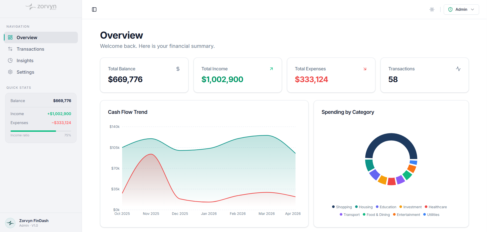
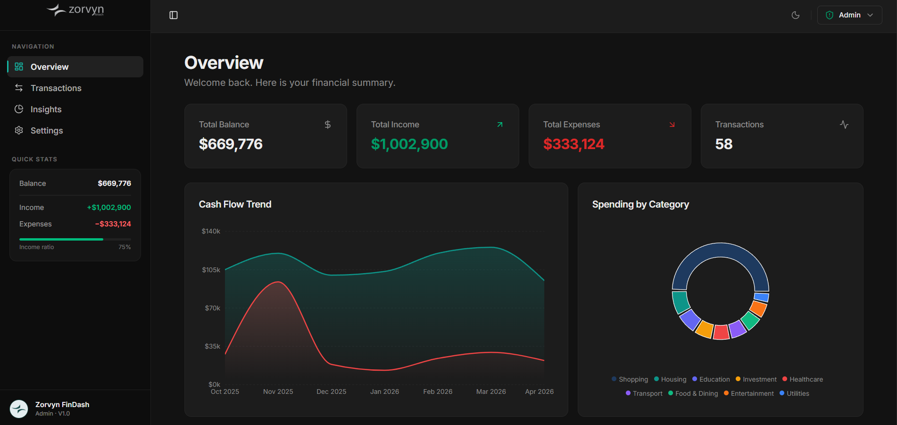
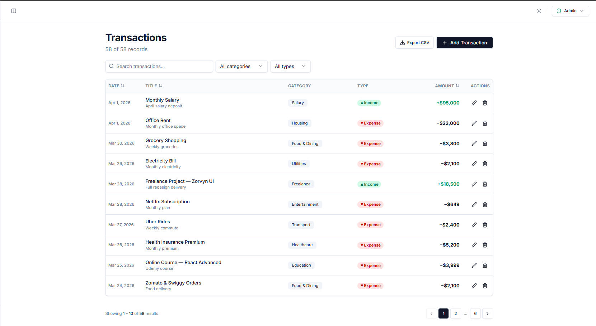
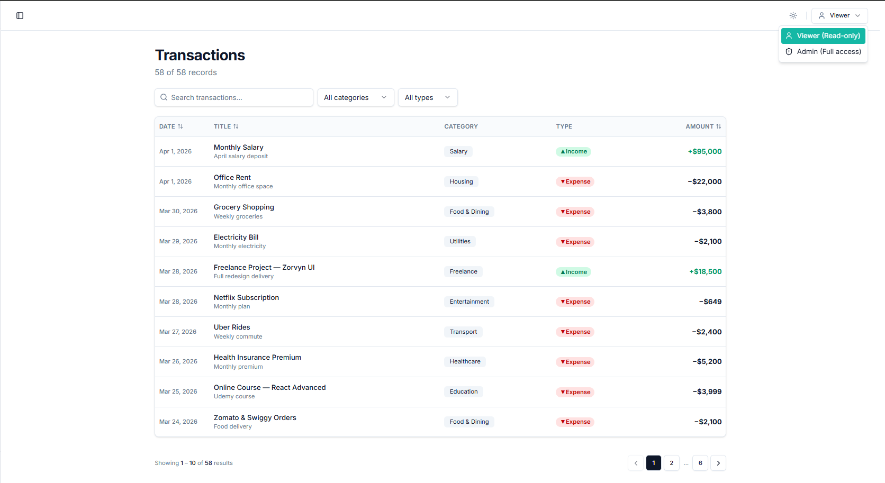
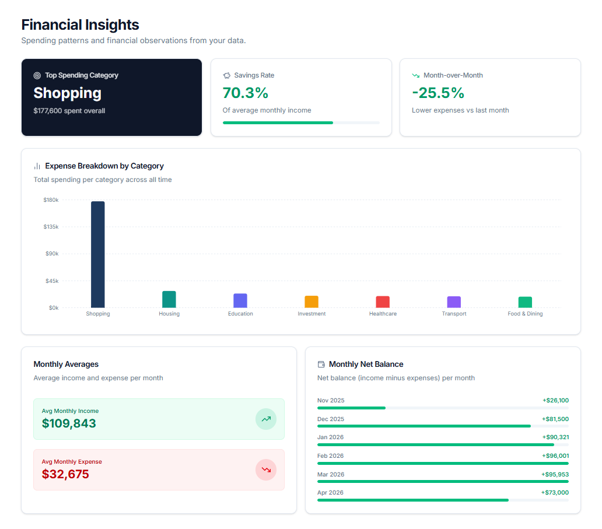
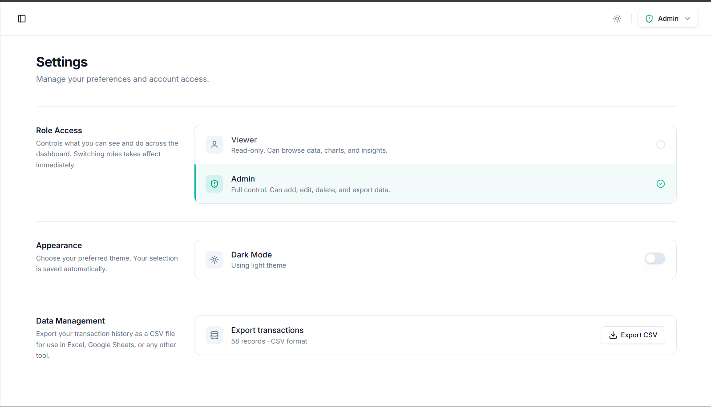

<div align="center">
  <h1>Zorvyn Finance Dashboard</h1>
  <p>A beautifully designed, highly interactive financial dashboard evaluating core frontend architecture, UI/UX aesthetics, and state management.</p>
  
  [](https://zorvyn-fdi.netlify.app)
</div>

---

## 🎨 Interface & Features Showcase

The dashboard is built with a strong focus on **clean, readable design** and handles features like dynamic theme switching, robust routing, and role-based views.

### 1. Dashboard Overview (Intelligent Theming)
The application fully supports system-level and manual theme switching. The layout uses purposeful micro-animations and "glass-minimalist" design principles instead of heavy, distracting gradients.

**Light Mode Overview:**
A vibrant, highly readable interface visualizing total balance, income/expense breakdowns, and quick transaction snapshots.


**Night Mode Overview:**
A sleek, eye-strain-friendly dark theme leveraging tailored HSL background variables that dynamically map to all components and charts.


### 2. Deep Transaction Management (Role-Based Access)
The application simulates an internal **Role-Based Access Control (RBAC)** architecture on the client-side. The UI adapts seamlessly based on the active role context. 

**Admin View (Full Access):**
Admins unlock the action columns, enabling them to Create, Edit, or Delete specific transactions. They also gain access to bulk CSV Exports.


**Viewer View (Read-only):**
When degraded to a Viewer role, sensitive actions and export utilities are safely unmounted from the DOM, creating a clean, read-only data layout.


### 3. Financial Insights & Analytics
Instead of dumping data into a table, the insights section aggregates the history into meaningful KPIs. It charts the highest spending categories, calculates month-over-month percentage changes, and dynamically plots net monthly balances.


### 4. Application Settings & Preferences
Users can control their permissions on the fly to simulate the RBAC pipeline. The settings page saves all application preferences directly to local storage to persist the user's environment.


---

## 🛠️ Assignment Objectives Met

### Core Requirements
- **Overview Dashboard:** Fully functional with summary cards of Total Balance, Income, Expenses, and savings rates alongside Recharts categorical data tracking.
- **Transactions Management:** Dynamic lists populated via state, featuring search functionality, category filters, and jitter-free table sorting. 
- **Role Simulation (RBAC):** `Viewer` vs `Admin` roles dictate layout capabilities, secured gracefully via React Contexts. 
- **Insights Context:** Calculates automated spending habits and historical balance trends.
- **State Management:** Uses React Context API + custom hooks to tightly manage and distribute global state.

### Optional Enhancements Integrated ⭐
- ✨ **System/Manual Dark Mode:** Executed perfectly via CSS variables.
- 💾 **Local Storage Persistence:** Refreshing the application will not lose your session's transactions or themes.
- ⚡ **Micro-Interactions & Animations:** Integrated `framer-motion` for fluid table pagination, modal reveals, and smooth page routing.
- 📊 **Export Functionality:** Admins can export the currently filtered table straight to a cleanly formatted CSV.

## 🚀 Technical Stack
- **Framework:** React 19 + Vite 
- **Routing:** `wouter` for lightweight, seamless page transitions
- **Styling:** Tailwind CSS (v4) + custom Shadcn-inspired flexible UI components
- **Logic & Utility:** `date-fns` for timeline formatting, `clsx` & `tailwind-merge` for class collision handling
- **Visuals:** Framer Motion (animations), Recharts (charts), Lucide React (icons)

## 💻 Local Setup

1. **Clone the repository**
   ```bash
   git clone https://github.com/vivek3931/zorvyn-assignment
   cd zorvyn-assignment
   ```

2. **Install dependencies**
   ```bash
   npm install
   ```

3. **Start the development server**
   ```bash
   npm run dev
   ```

*(This application relies on zero external backend APIs, meaning `npm run dev` instantly provisions the entire full-stack experience via Mock logic.)*
